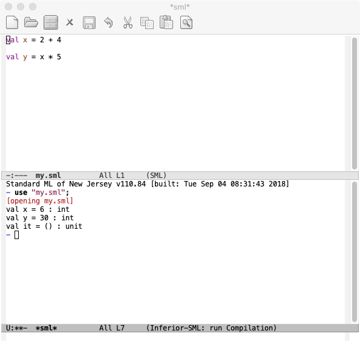

## 课程信息

在知乎上[Coursera 上有哪些课程值得推荐？](https://www.zhihu.com/question/22436320)问题下看到了`字节`的回答下首推了这门课程——华盛顿大学的 [Programming Languages](https://www.coursera.org/learn/programming-languages)，大致看了下大纲，适合有一门编程语言背景的学生，目的是通过讲述几门小众语言来描述编程范式（尤其注重函数式编程范式）。整个课程分为三部分，A 部分讲解 SML，B 部分讲解 Racket，C 部分讲解 Ruby。

之前看过王垠的[《如何掌握所有的程序语言》](http://www.yinwang.org/blog-cn/2017/07/06/master-pl)，而 Programming Languages 大概就是学习编程语言特性的最好的课程。

## 安装 SML 环境

第一部分讲解 SML，使用 Emacs 做编程环境，我使用了是 Mac OS。

下面是一些基础的概念：

- SML(Standard Meta Language)：一种标准的函数式编程语言
- M：指 `alt` 键
- C：指 `control` 键
- REPL(Read-Eval-Print Loop)：读取-求值-输出循环，是一个简单的、交互的编程环境

### 安装 Emacs

可以从 [http://emacsformacosx.com/](http://emacsformacosx.com/)下载 Emacs，下面是一些基本命令：

- C-x C-c：退出 Emacs
- C-g：撤回当前操作
- C-x C-f：打开一个文件
- C-x C-s：保存一个文件
- C-x C-w：写一个文件

### 安装 SML/NJ

[下载 smlnj](http://www.smlnj.org/dist/working/110.80/)，在 `/.bash_profile` 中配置环境变量：

```bash
export PATH="$PATH:/usr/local/smlnj/bin"
```

打开 Terminal 输入 sml 将会看到 `Standard ML of New Jersey v110.80 [built: ...]` 的字样。

### 安装 SML Mode

SML Mode 就相当于 Emacs 和 SML 结合的模块。在 Emacs 中运行 `M-x list-packages`，找到 `sml-mode` 点击安装，在 `~/.emacs` 中添加环境变量：

```bash
(setenv "PATH" (concat "/usr/local/smlnj/bin:" (getenv "PATH")))
(setq exec-path (cons "/usr/local/smlnj/bin"  exec-path))
``` 

重启 Emacs，直接创建一个 `my.sml` 拖进 Emacs 中，输入内容：

```sml
val x = 2 + 4
val y = x * 5
```

`C-x C-s` 保存，`C-c C-s` + Return 创建 SML/NJ REPL，相当于创建一个交互的界面，输入 `use "my.sml"` 显示结果。



神的编辑器。


> 参考：
> [在Emacs用SML](https://www.jianshu.com/p/f6115fd42929)
> [Programing Languages Part A Note（一）：工欲善其事，必先利其器](https://zhuanlan.zhihu.com/p/37518107)